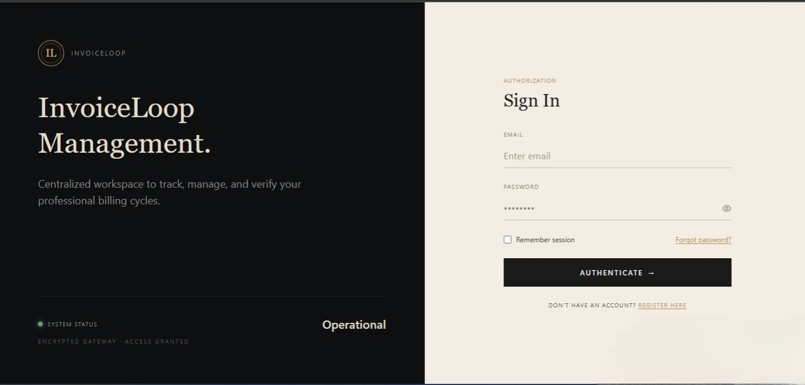
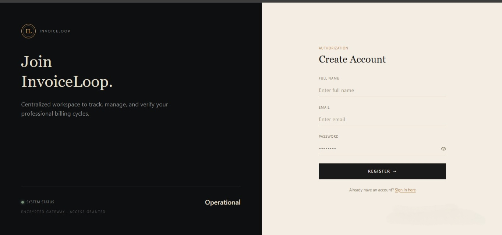
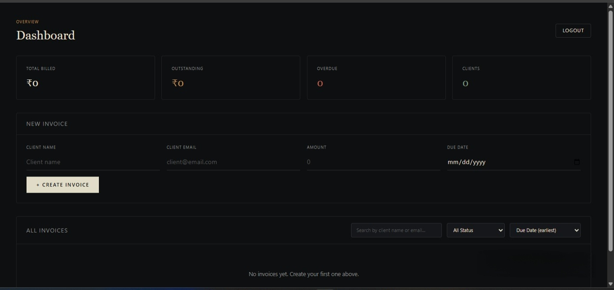

# InvoiceLoop

> Recurring invoice tracking for freelancers — create invoices, track who owes you, and get paid on time.


**Live demo →** https://invoiceloop-black.vercel.app

**Demo video →** [Watch on Loom](https://loom.com/share/69acaef243704f13ab7109a1c2a326fe)

## Demo Login

Email:    demo@demo.com
Password: demo1234

*(Create this account once via Register, or swap in your own test account.)*

## Features

- Email/password authentication with JWT sessions
- Create, edit, delete, and toggle invoice status (Paid / Pending)
- Dashboard stats: total billed, outstanding, overdue count, unique clients
- Search, status filter, and sort by due date / amount / client
- One-click PDF export per invoice
- Fully responsive — table view on desktop, card view on mobile
- Toast notifications for every create/update/delete action
- Zod validation for API inputs
- Rate limiting on authentication routes
- Basic backend authentication tests

## Tech Stack
Frontend: React (Vite) · TypeScript · Tailwind CSS · Axios · React Router · jsPDF
Backend: Node.js · Express · TypeScript · MongoDB (Mongoose) · JWT auth · Zod
**Hosting:** Vercel (frontend) · Render (backend) · MongoDB Atlas (database)

## Quick Start

```bash
git clone https://github.com/nishu0509/invoiceloop.git
cd invoiceloop

# Backend
cd backend
npm install
cp .env.example .env
npm run dev

# Frontend (new terminal)
cd ../frontend
npm install
cp .env.example .env
npm run dev
```

## Environment Variables

**backend/.env**

| Variable      | Description                                  |
| ------------- | --------------------------------------------- |
| `PORT`        | Port the Express server listens on (default `5000`) |
| `MONGO_URI`   | MongoDB connection string                    |
| `JWT_SECRET`  | Secret used to sign JWT auth tokens          |

**frontend/.env**

| Variable         | Description                                  |
| ---------------- | --------------------------------------------- |
| `VITE_API_URL`   | Base URL of the backend API, e.g. `https://your-backend.onrender.com/api/v1` |

## Architecture

- **Auth:** Users register/log in with email + password; the backend hashes passwords and issues a JWT stored client-side. Protected routes are guarded both by frontend route checks and backend middleware.
- **Data model:** A `User` owns many `Invoice` documents (client name, email, amount, due date, status). All invoice routes verify the requesting user owns the invoice before returning or mutating it.
- Full write-up in [`docs/architecture.md`](docs/architecture.md).

## Roadmap

- [ ] Pagination for large invoice lists
- [ ] Recurring invoice scheduling
- [ ] Email reminders for overdue invoices
- [ ] Role-based access (owner vs. team member)

## Screenshots

| Sign In | Register | Dashboard |
| --- | --- | --- |
|  |  |  |

## License

MIT — see [LICENSE](LICENSE).

---
*Built as part of the Digital Heroes Full Stack Developer Trial.*
